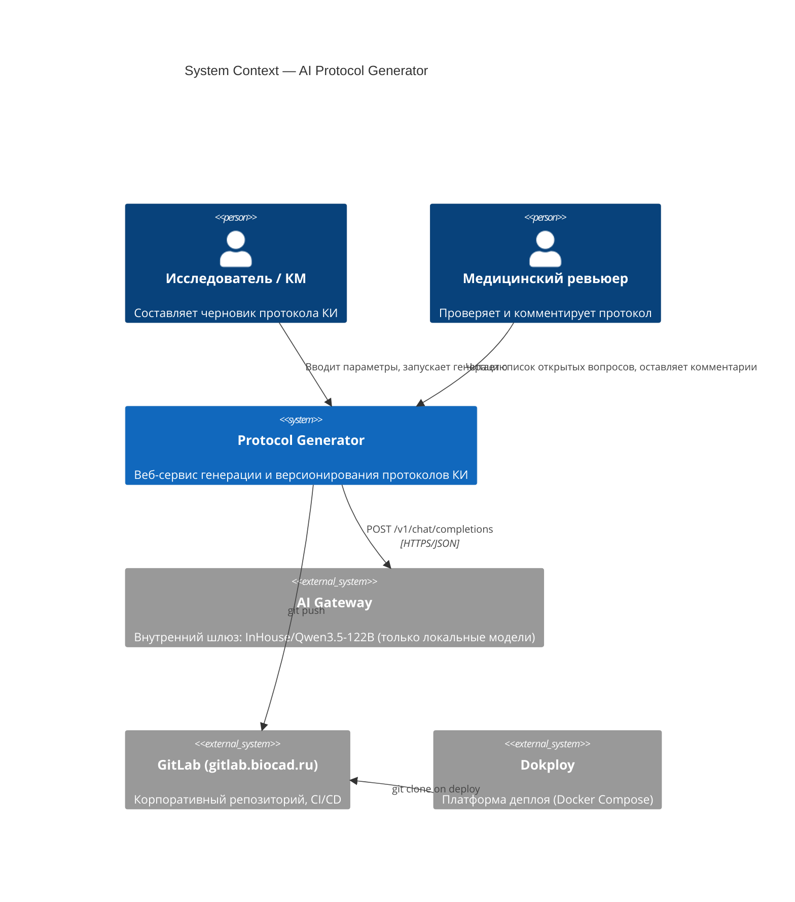
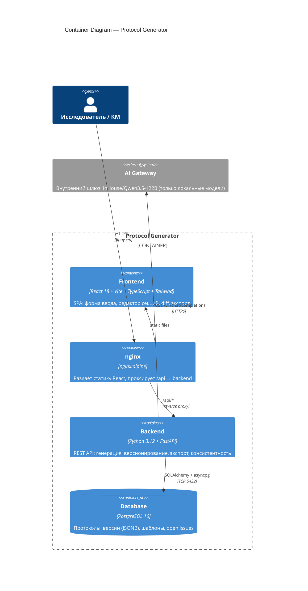
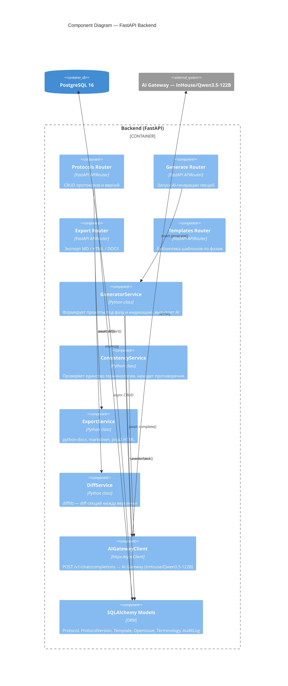
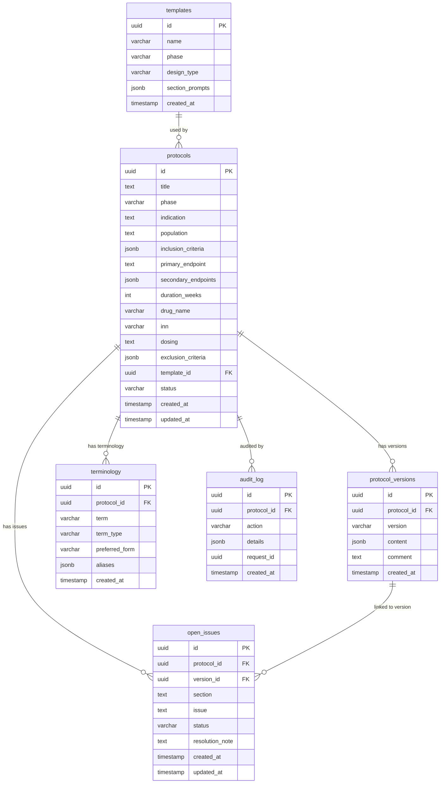
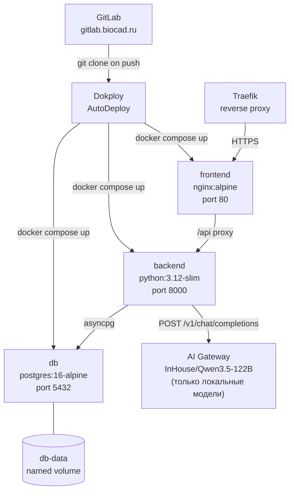

# Архитектура: AI-генератор протоколов клинических исследований

**Version:** 1.2.0 | **Date:** 2026-04-23 | **Status:** Draft

---

## C4 Level 1 — System Context

---

## C4 Level 2 — Container

---

## C4 Level 3 — Components (Backend)

---

## Data Model

---

## Deploy (Docker Compose на Dokploy)

