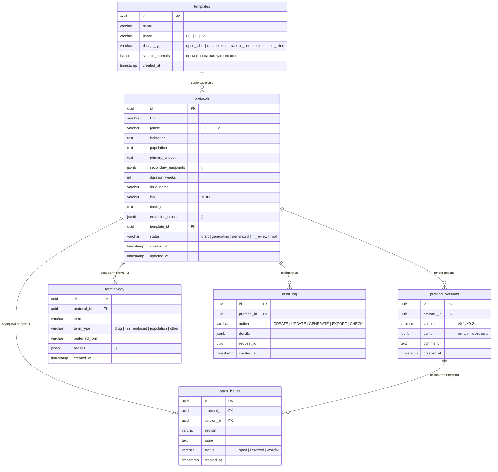

# A-004: ER Diagram

**Version:** 1.0.0 | **Date:** 2026-04-23 | **Status:** Draft  
**Artifact ID:** A-004  
**Связанный документ:** [docs/database-schema.md](database-schema.md) — полная DDL-схема

---

## ER-диаграмма

---

## Ключевые решения схемы

| Решение | Обоснование |
|---|---|
| `content JSONB` в `protocol_versions` | Гибкость секций без миграций; diff на уровне Python |
| `terminology` как отдельная таблица | Консистентность МНН/названий — ядро GCP-требования |
| `audit_log` отдельно | GCP E6 требует immutable trail всех изменений |
| `status` в `protocols` | State machine для управления жизненным циклом |
| `UNIQUE(protocol_id, version)` | Версия в рамках протокола уникальна |

---

> Полная DDL с индексами и CHECK constraints: [docs/database-schema.md](database-schema.md)
