# A-001: Event Storming

**Version:** 1.0.0 | **Date:** 2026-04-23 | **Status:** Draft  
**Artifact ID:** A-001

Domain: AI-генератор протоколов клинических исследований  
Нотация: упрощённый Big Picture Event Storming (Events → Commands → Aggregates → Policies)

---

## Легенда

| Цвет | Тип | Описание |
|---|---|---|
| 🟠 Orange | Domain Event | Что произошло в системе (прошедшее время) |
| 🔵 Blue | Command | Что инициирует событие (повелительное наклонение) |
| 🟡 Yellow | Actor | Кто выполняет команду |
| 🟣 Purple | Policy / Rule | Автоматическая реакция на событие |
| 🟢 Green | Read Model | Что видит пользователь |
| 🔴 Red | Aggregate | Корневая сущность, принимающая команды |

---

## Диаграмма

```mermaid
flowchart LR
  subgraph TEMPLATE["🔴 Template Aggregate"]
    CMD_TMPL["🔵 SelectTemplate"]
    EVT_TMPL["🟠 TemplateSelected"]
    CMD_TMPL --> EVT_TMPL
  end

  subgraph PROTOCOL["🔴 Protocol Aggregate"]
    direction TB
    ACT1["🟡 Researcher"]

    CMD1["🔵 CreateProtocol"]
    EVT1["🟠 ProtocolCreated"]

    CMD2["🔵 EnterParameters"]
    EVT2["🟠 ParametersEntered"]

    CMD3["🔵 StartGeneration"]
    EVT3["🟠 GenerationStarted"]

    POL1["🟣 Trigger AI per section"]

    EVT4["🟠 SectionGenerated\nintroduction"]
    EVT5["🟠 SectionGenerated\nobjectives"]
    EVT6["🟠 SectionGenerated\ndesign ... ethics"]

    EVT7["🟠 AllSectionsGenerated"]
    POL2["🟣 Auto-save as v0.1"]
    EVT8["🟠 VersionCreated v0.1"]

    ACT1 --> CMD1
    CMD1 --> EVT1
    EVT1 --> CMD2
    CMD2 --> EVT2
    EVT2 --> CMD3
    CMD3 --> EVT3
    EVT3 --> POL1
    POL1 --> EVT4
    POL1 --> EVT5
    POL1 --> EVT6
    EVT4 & EVT5 & EVT6 --> EVT7
    EVT7 --> POL2
    POL2 --> EVT8
  end

  subgraph CONSISTENCY["🔴 Consistency Aggregate"]
    CMD4["🔵 CheckConsistency"]
    EVT9["🟠 ConsistencyChecked"]
    EVT10["🟠 ContradictionFound"]
    EVT11["🟠 TerminologyIssueFound"]
    POL3["🟣 Add to OpenIssues"]

    CMD4 --> EVT9
    EVT9 --> EVT10
    EVT9 --> EVT11
    EVT10 --> POL3
    EVT11 --> POL3
  end

  subgraph VERSION["🔴 Version Aggregate"]
    CMD5["🔵 RegenerateSection"]
    EVT12["🟠 SectionRegenerated"]
    POL4["🟣 Auto-save as v0.2"]
    EVT13["🟠 VersionCreated v0.2"]

    CMD6["🔵 CompareVersions"]
    EVT14["🟠 DiffCalculated"]

    CMD5 --> EVT12
    EVT12 --> POL4
    POL4 --> EVT13
    CMD6 --> EVT14
  end

  subgraph EXPORT["🔴 Export Aggregate"]
    ACT2["🟡 Researcher"]
    ACT3["🟡 Medical Reviewer"]

    CMD7["🔵 ExportDocument"]
    EVT15["🟠 DocumentExported\nMD / HTML / DOCX"]

    CMD8["🔵 ExportOpenIssues"]
    EVT16["🟠 OpenIssuesExported"]

    ACT2 --> CMD7
    ACT3 --> CMD8
    CMD7 --> EVT15
    CMD8 --> EVT16
  end

  EVT_TMPL --> CMD1
  EVT8 --> CMD4
  EVT8 --> CMD7
  EVT13 --> CMD6
```

---

## Агрегаты и их команды/события

### Template
| Команда | Событие |
|---|---|
| SelectTemplate | TemplateSelected |

### Protocol
| Команда | Событие |
|---|---|
| CreateProtocol | ProtocolCreated |
| EnterParameters | ParametersEntered |
| StartGeneration | GenerationStarted → SectionGenerated × N → AllSectionsGenerated |

### Consistency
| Команда | Событие |
|---|---|
| CheckConsistency | ConsistencyChecked, ContradictionFound, TerminologyIssueFound |

### Version
| Команда | Событие |
|---|---|
| RegenerateSection | SectionRegenerated → VersionCreated |
| CompareVersions | DiffCalculated |

### Export
| Команда | Событие |
|---|---|
| ExportDocument | DocumentExported |
| ExportOpenIssues | OpenIssuesExported |

---

## Политики (автоматические реакции)

| Политика | Триггер | Действие |
|---|---|---|
| Trigger AI per section | GenerationStarted | Запуск AI-генерации для каждой секции параллельно |
| Auto-save as v0.1 | AllSectionsGenerated | Создание версии v0.1 |
| Auto-save as vX.N | SectionRegenerated | Инкремент версии |
| Add to OpenIssues | ContradictionFound / TerminologyIssueFound | Добавить в open_issues |
| Log to AuditLog | Любое доменное событие | Запись в audit_log |
