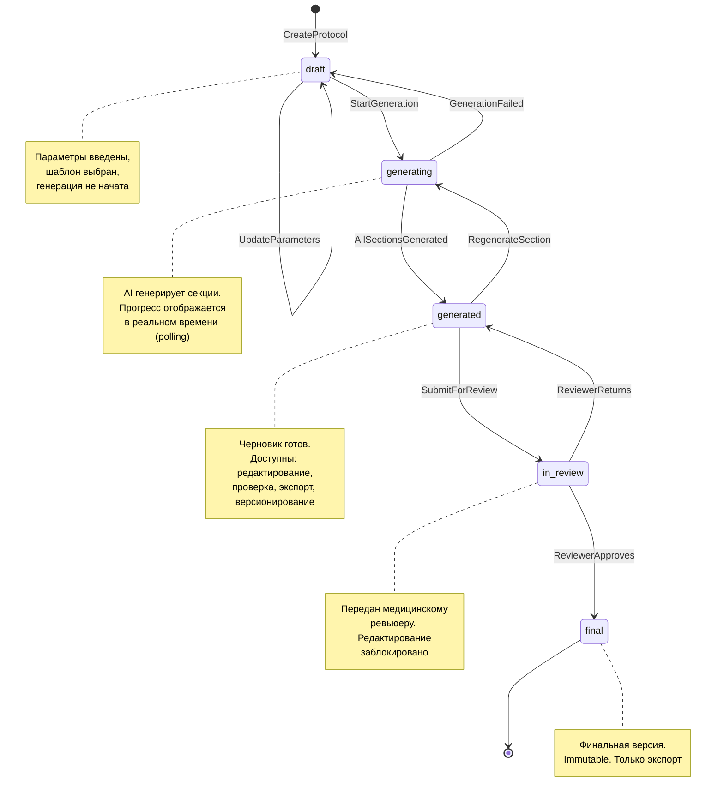
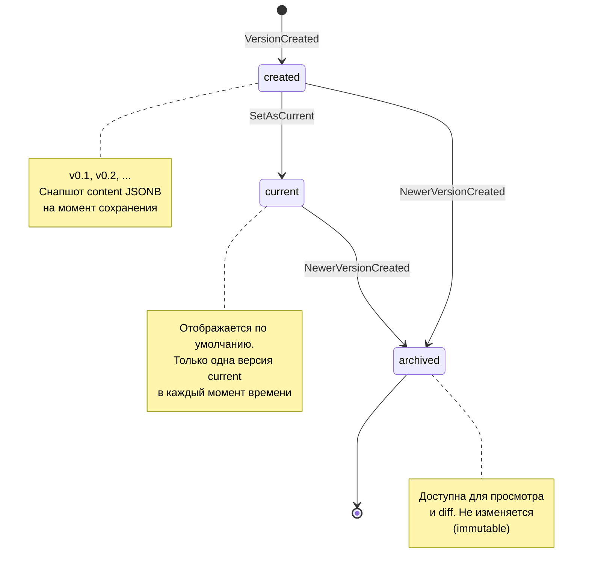
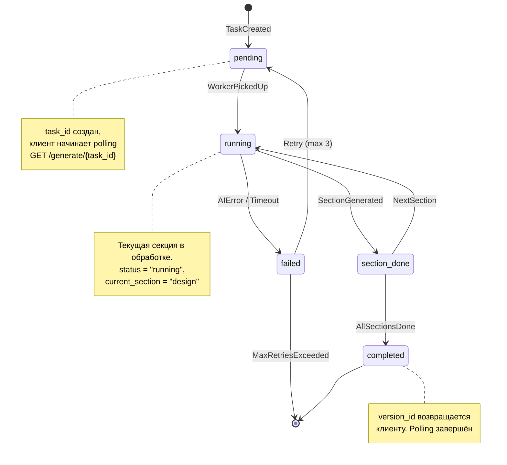
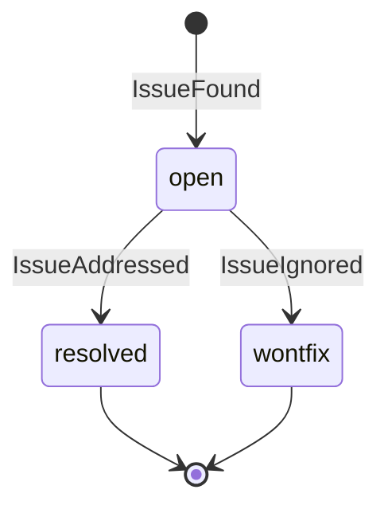

# A-003: State Diagram

**Version:** 1.0.0 | **Date:** 2026-04-23 | **Status:** Draft  
**Artifact ID:** A-003

---

## Жизненный цикл протокола (Protocol)

---

## Жизненный цикл версии (ProtocolVersion)

---

## Жизненный цикл задачи генерации (GenerationTask)

---

## Жизненный цикл открытого вопроса (OpenIssue)

