# A-005: Use Case Diagram

**Version:** 1.0.0 | **Date:** 2026-04-23 | **Status:** Draft  
**Artifact ID:** A-005

---

## Акторы

| Актор | Роль |
|---|---|
| **Исследователь / КМ** | Создаёт протоколы, запускает генерацию, управляет версиями, экспортирует |
| **Медицинский ревьюер** | Просматривает сгенерированные протоколы, работает со списком вопросов |
| **AI Gateway** | Внутренняя система (InHouse/Qwen3.5-122B), генерирует текст секций и проводит валидацию |
| **Система** | Автоматические процессы: версионирование, аудит, consistency check |

---

## Use Case Diagram

```mermaid
graph TB
  subgraph ACTORS["Акторы"]
    RES["👤 Исследователь / КМ"]
    REV["👤 Медицинский Ревьюер"]
    AI["AI Gateway (InHouse/Qwen3.5-122B)"]
    SYS["⚙️ Система"]
  end

  subgraph SYSTEM["AI Protocol Generator"]
    subgraph PROTOCOL_MGMT["Управление протоколами"]
      UC1["UC-01\nСоздать протокол"]
      UC2["UC-02\nВыбрать шаблон"]
      UC3["UC-03\nВвести параметры"]
      UC4["UC-04\nОткрыть протокол"]
      UC5["UC-05\nПросмотреть список"]
    end

    subgraph GENERATION["Генерация"]
      UC6["UC-06\nЗапустить генерацию"]
      UC7["UC-07\nОтслеживать прогресс"]
      UC8["UC-08\nПерегенерировать секцию"]
      UC9["UC-09\nГенерировать SAP"]
      UC10["UC-10\nГенерировать ICF"]
    end

    subgraph VALIDATION["Валидация"]
      UC11["UC-11\nПроверить консистентность"]
      UC12["UC-12\nПолучить GCP-подсказки"]
      UC13["UC-13\nПросмотреть противоречия"]
    end

    subgraph VERSIONING["Версионирование"]
      UC14["UC-14\nПросмотреть историю версий"]
      UC15["UC-15\nСравнить версии (diff)"]
      UC16["UC-16\nОткрыть конкретную версию"]
    end

    subgraph EXPORT["Экспорт"]
      UC17["UC-17\nЭкспорт в Markdown"]
      UC18["UC-18\nЭкспорт в HTML"]
      UC19["UC-19\nЭкспорт в DOCX"]
      UC20["UC-20\nЭкспорт открытых вопросов"]
    end
  end

  RES --> UC1
  RES --> UC2
  RES --> UC3
  RES --> UC4
  RES --> UC5
  RES --> UC6
  RES --> UC7
  RES --> UC8
  RES --> UC9
  RES --> UC10
  RES --> UC11
  RES --> UC14
  RES --> UC15
  RES --> UC17
  RES --> UC18
  RES --> UC19

  REV --> UC4
  REV --> UC13
  REV --> UC14
  REV --> UC16
  REV --> UC20

  UC6 -.->|"<<include>>"| AI
  UC8 -.->|"<<include>>"| AI
  UC9 -.->|"<<include>>"| AI
  UC10 -.->|"<<include>>"| AI
  UC11 -.->|"<<include>>"| AI
  UC12 -.->|"<<include>>"| AI

  UC6 -.->|"<<extend>>"| SYS
  SYS -.->|"auto версионирование"| UC14
```

---

## Use Case Descriptions

### UC-01: Создать протокол
**Актор:** Исследователь  
**Предусловие:** Нет активной сессии создания  
**Основной поток:**
1. Исследователь нажимает "+ Новый протокол"
2. Система предлагает выбрать шаблон (UC-02)
3. Исследователь заполняет форму параметров (UC-03)
4. Система валидирует и сохраняет протокол в статусе `draft`

**Постусловие:** Протокол создан, статус `draft`

---

### UC-06: Запустить генерацию
**Актор:** Исследователь  
**Предусловие:** Протокол в статусе `draft`, все обязательные параметры заполнены  
**Основной поток:**
1. Исследователь нажимает "Сгенерировать"
2. Система создаёт GenerationTask, статус → `generating`
3. Для каждой из 9 секций: формирует промпт → вызывает AI → сохраняет результат
4. Система сохраняет все секции как `protocol_versions v0.1`, статус → `generated`
5. Исследователь видит готовый черновик

**Альтернативный поток (AI error):** система повторяет попытку (max 3), при неудаче → статус `draft`, уведомление

**Постусловие:** Версия v0.1 создана, протокол в статусе `generated`

---

### UC-11: Проверить консистентность
**Актор:** Исследователь / Система  
**Предусловие:** Версия протокола существует  
**Основной поток:**
1. Исследователь нажимает "Проверить консистентность"
2. Система отправляет все секции в AI с промптом consistency-check
3. AI возвращает JSON: `contradictions[]`, `terminology_issues[]`, `compliance_score`
4. Система отображает панель с найденными проблемами
5. Найденные противоречия автоматически добавляются в `open_issues`

**Постусловие:** Список противоречий отображён, open_issues обновлён

---

### UC-15: Сравнить версии (diff)
**Актор:** Исследователь / Медревьюер  
**Предусловие:** Протокол имеет минимум 2 версии  
**Основной поток:**
1. Пользователь выбирает "Сравнить" в истории версий
2. Выбирает версии A и B
3. Система вычисляет diff на уровне секций (difflib)
4. Отображает: секции без изменений / изменённые / добавленные / удалённые

**Постусловие:** Diff отображён в UI

---

## MVP Use Cases (реализуются в первую очередь)

| Use Case | Приоритет |
|---|---|
| UC-01 Создать протокол | 🔴 P0 |
| UC-02 Выбрать шаблон | 🔴 P0 |
| UC-03 Ввести параметры | 🔴 P0 |
| UC-05 Просмотреть список | 🔴 P0 |
| UC-06 Запустить генерацию | 🔴 P0 |
| UC-07 Отслеживать прогресс | 🔴 P0 |
| UC-17 Экспорт в Markdown | 🔴 P0 |
| UC-18 Экспорт в HTML | 🟡 P1 |
| UC-19 Экспорт в DOCX | 🟡 P1 |
| UC-08 Перегенерировать секцию | 🟡 P1 |
| UC-11 Проверить консистентность | 🟡 P1 |
| UC-14 История версий | 🟡 P1 |
| UC-15 Сравнить версии | 🔵 P2 |
| UC-09 SAP артефакт | 🔵 P2 |
| UC-10 ICF артефакт | 🔵 P2 |
| UC-20 Открытые вопросы | 🔵 P2 |
